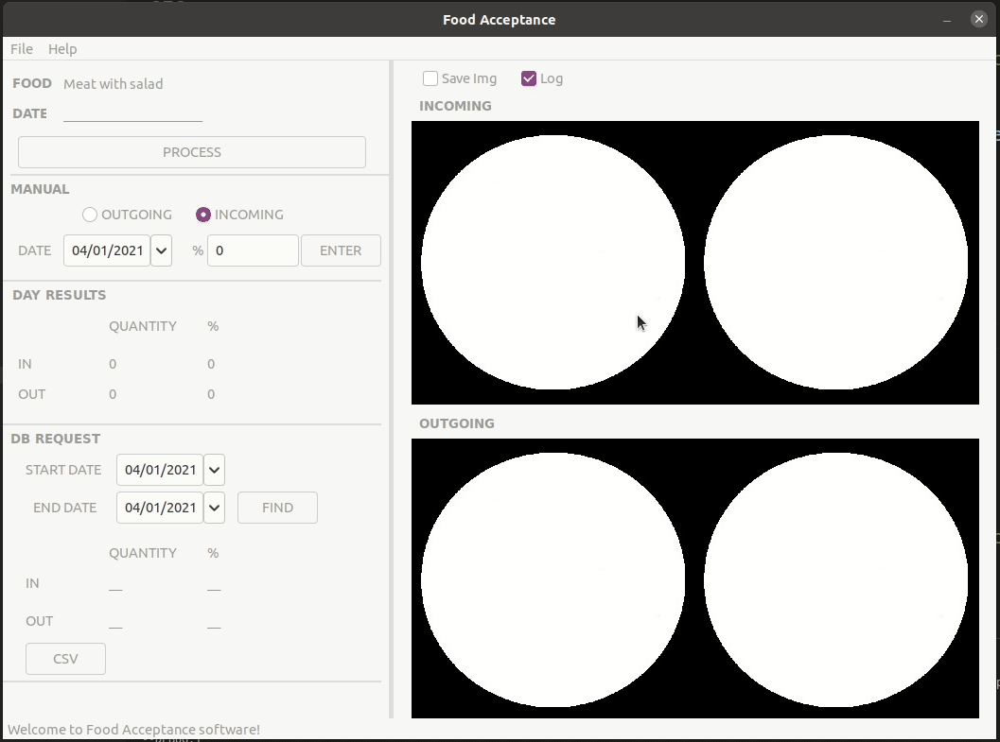
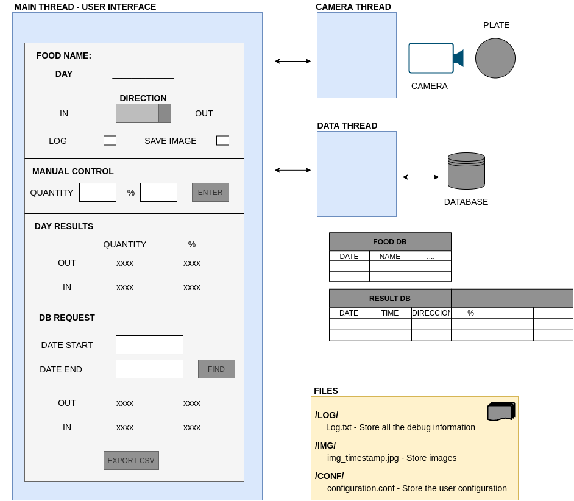
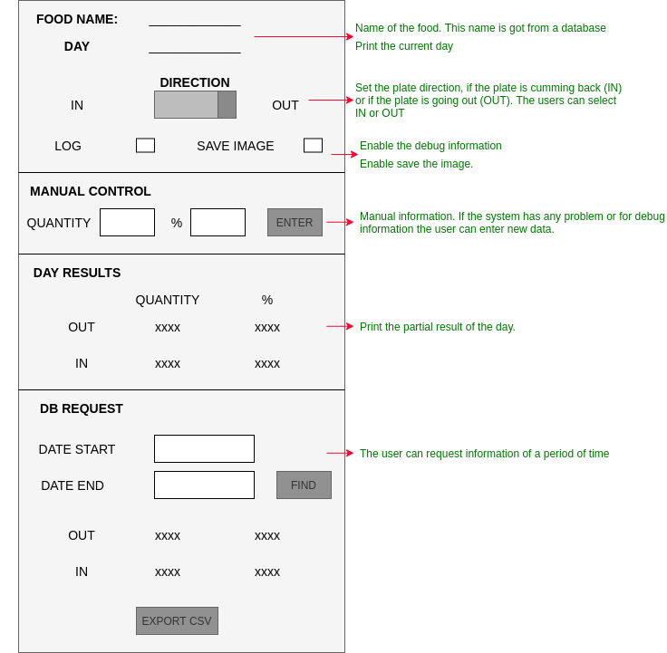
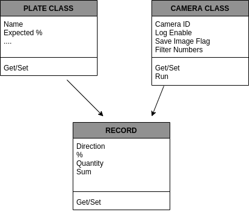

# Food acceptance Project

This repo contains My C++ Capstone Project for the Object Oriented Programming Course of the Udacity C++ Nanodegree Program.[Link](https://www.udacity.com/course/c-plus-plus-nanodegree--nd213)

The food acceptance project is created to control how much food is accepted in meals preparation. It is focused mainly on places where we can find one plate for the day, for example in my country (Argentina) it is very common at community kitchens, companies, schools cafeteria, etc. The main idea is to avoid throwing food and get statistics of food acceptance.
Another important motivation for this software is to find what food is not accepted and find other ways of preparing this meals in a way that covers all the nutrients needed for children/adults.

 

Please for more information check the below items where you can find the code design, tests, and rubric items description.

## Dependencies for Running Locally
* cmake >= 2.8
  * All OSes: [click here for installation instructions](https://cmake.org/install/)
* make >= 4.1 (Linux, Mac), 3.81 (Windows)
  * Linux: make is installed by default on most Linux distros
  * Mac: [install Xcode command line tools to get make](https://developer.apple.com/xcode/features/)
  * Windows: [Click here for installation instructions](http://gnuwin32.sourceforge.net/packages/make.htm)
* gcc/g++ >= 5.4
  * Linux: gcc / g++ is installed by default on most Linux distros
  * Mac: same deal as make - [install Xcode command line tools](https://developer.apple.com/xcode/features/)
  * Windows: recommend using [MinGW](http://www.mingw.org/)

* OpenCV >= 4.1
  * The OpenCV 4.1.0 source code can be found [here](https://github.com/opencv/opencv/tree/4.1.0)
* wxWidgets >= 3.0
  * Linux: `sudo apt-get install libwxgtk3.0-dev libwxgtk3.0-0v5-dbg`
  * Mac: There is a [homebrew installation available](https://formulae.brew.sh/formula/wxmac).
  * Installation instructions can be found [here](https://wiki.wxwidgets.org/Install). Some version numbers may need to be changed in instructions to install v3.0 or greater.

* SQLITE3 >= 3.31.1
  * The SQLITE3 3.31.1 source code can be found [here](https://www.sqlite.org/download.html)
     * Linux: `sudo apt-get install sqlite3 libsqlite3-dev`
 
## Basic Build Instructions

1. Clone this repo.
2. Make a build directory in the top level directory: `mkdir build && cd build`
3. Compile: `cmake .. && make`
4. Run it: `./food`

## Design
The following design will cover the main ideas and code functionality. This design was made at the beginning of the project, because of that you may find some small differences with the final implementation.

The code is separated into three threads. The main thread, Camera thread, and Data thread. For the first code implementation, the idea is only to have one camera, but in the future, the idea is to have one thread per camera.

 

The main thread will support the user interface. This user interface will be done using the wxWidgets library [link](https://www.wxwidgets.org/). The user   can control the following information:

 

The camera thread will perform the capture action and percentage calculation using the OpenCV library functionalities [link](https://opencv.org/). A promise and future are used to pass the data to the main thread.
To process the image the idea is to filter by the plate color and then calculate how many pixels are white and how many black. For future implementation, the idea is to cover different plates and different colors
IMPORTANT: For the first version the code will use a static image located in the test folder.

The data thread is blocked until receiving new data to store in the database. This thread will have a message queue implementation.

The code will have the following classes where will be covering most part of the information and actions.

  

## Testing
The repo will have images in the data folder to check the code operations. The first version only uses those images, not support the live camera but the tester can change those images to testing.
In the repository is store a DB with information to check the operation of find and csv.

## Rubric Points

**Readme** 
All Points are completed on this document.
**Compiling and testing**
The project compiles and runs without errors/warning. The project uses CMake and make.
**Loops, Functions, I/O**
In the Data base object is one example where find this Rubric Points.
**Object Oriented Programming**
The final project has Plate, Debug, DB, Camera objects.
**Memory Management**
The Camera process store the object result in the DB.
**Concurrency**
The Camera open one thread to process the incoming images and one to outgoing images.

## Improvements

 - Support multi-cameras
 - Support different plates and colors
 - Support different menus on the same day (Restaurants)
 - Identify the food
 - Calculation of nutrient
 - Selftest only check the debug and plate classes. Add test for the others classes.