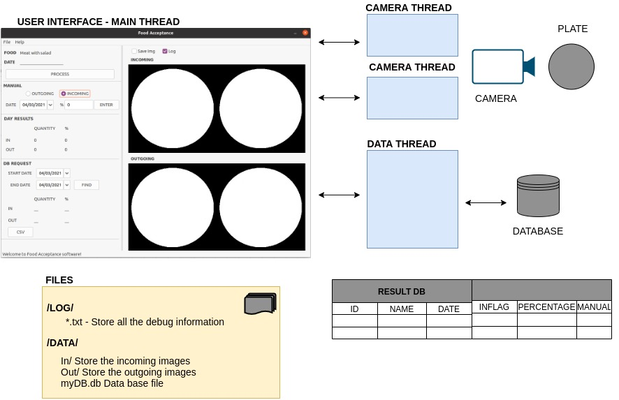
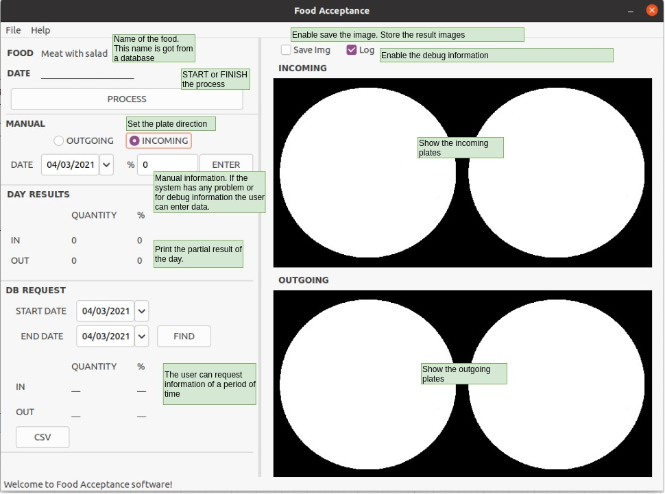
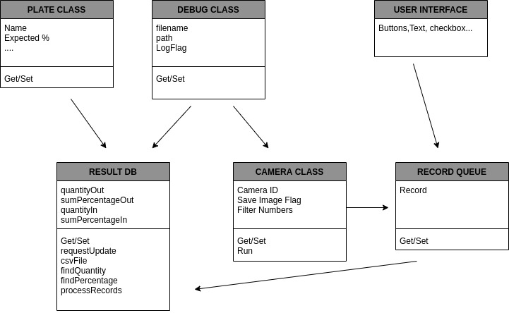

# Food acceptance Project
  

This repo contains My C++ Capstone Project for the Object Oriented Programming Course of the Udacity C++ Nanodegree Program.[Link](https://www.udacity.com/course/c-plus-plus-nanodegree--nd213)

  

The food acceptance project is created to control how much food is accepted in meals preparation. It is focused mainly on places where we can find one plate for the day, for example in my country (Argentina) it is very common at community kitchens, companies, schools cafeteria, etc. The main idea is to avoid throwing food and get statistics of food acceptance.

Another important motivation for this software is to find what food is not accepted and find other ways of preparing this meals in a way that covers all the nutrients needed for children/adults.

  

  

  
  

Please for more information check the below items where you can find the code design, tests, and rubric items description.

  

## Dependencies for Running Locally

* cmake >= 2.8

* All OSes: [click here for installation instructions](https://cmake.org/install/)

* make >= 4.1 (Linux, Mac), 3.81 (Windows)

* Linux: make is installed by default on most Linux distros

* Mac: [install Xcode command line tools to get make](https://developer.apple.com/xcode/features/)

* Windows: [Click here for installation instructions](http://gnuwin32.sourceforge.net/packages/make.htm)

* gcc/g++ >= 5.4

* Linux: gcc / g++ is installed by default on most Linux distros

* Mac: same deal as make - [install Xcode command line tools](https://developer.apple.com/xcode/features/)

* Windows: recommend using [MinGW](http://www.mingw.org/)

  

* OpenCV >= 4.1

* The OpenCV 4.1.0 source code can be found [here](https://github.com/opencv/opencv/tree/4.1.0)

* wxWidgets >= 3.0

* Linux: `sudo apt-get install libwxgtk3.0-dev libwxgtk3.0-0v5-dbg`

* Mac: There is a [homebrew installation available](https://formulae.brew.sh/formula/wxmac).

* Installation instructions can be found [here](https://wiki.wxwidgets.org/Install). Some version numbers may need to be changed in instructions to install v3.0 or greater.

  

* SQLITE3 >= 3.31.1

* The SQLITE3 3.31.1 source code can be found [here](https://www.sqlite.org/download.html)

* Linux: `sudo apt-get install sqlite3 libsqlite3-dev`

## Basic Build Instructions
  

1. Clone this repo.

2. Make a build directory in the top level directory: `mkdir build && cd build`

3. Compile: `cmake .. && make`

4. Run it: `./food`

  
## Design

The following design will cover the main ideas and code functionality. This design was reviewed while the code was implemented. If you want to see the first code design check [previous version](https://github.com/mdarino/Udacity_CPP_FoodAcceptance-/tree/8a0c27c7c95bc2e5c07e87ae03de6298974f0b70)
Note:
Incoming: The plate comes with food to the person.
OutGoing: The plate returns to the kitchen empty, leaves the living room

The code is separated into four threads. The main thread, 2 Camera thread (One incoming and one Outgoing), and Data thread. For the first code implementation, the idea is simulate the cameras with images.
  

  

  
The main thread will support the user interface. This user interface will be done using the wxWidgets library [link](https://www.wxwidgets.org/). The user can control the following information:

  

  

  

The camera thread will perform the capture action and percentage calculation using the OpenCV library functionalities [link](https://opencv.org/).  The result will be queue and process latter for the data thread. 

To process the image the idea is to filter by the plate color and then calculate how many pixels are white and how many black. For future implementation, the idea is to cover different plates and different colors

IMPORTANT: For the first version the code will use a static image located in the test folder.

The data thread is blocked until receiving new data to store in the database. This thread will have a message queue implementation.

  

  

## Testing

The repo will have images in the data folder to check the code operations. The first version only uses those images, not support the live camera but the tester can change those images to testing.

To Run press the PROCESS button and you will see random images in the user interface which was processed and stored in the DB and uou can find more information in the debug files and console output.

In the repository is saved a DB with information to check the operation of find and csv.

## Improvements

- Support different plates and colors

- Support different menus on the same day (Restaurants)

- Identify the food

- Calculation of nutrient

- Selftest only check the debug and plate classes. Add test for the others classes.

## Rubric Points

  
**README**

- A README with instructions is included with the project
    - The README is included with the project and has instructions for building/running the project. *(DONE: See Basic Build Instructions item in readme file)*
          
    - If any additional libraries are needed to run the project, these are indicated with cross-platform installation instructions. *(DONE: See Dependencies for Running Locally  item in readme file)*

- The README indicates which project is chosen.
    - The README describes the project you have built.  *(DONE: See Food acceptance Project item in readme file)*
    - The README also indicates the file and class structure, along with the expected behavior or output of the program.  *(DONE: See Design item in readme file)*

- The README includes information about each rubric point addressed.
    - The README indicates which rubric points are addressed. *(DONE: See Rubric Points item in readme file)*

**Compiling and Testing**

- The submission must compile and run.
    - The project code must compile and run without errors. *(DONE)*
    - We strongly recommend using  `cmake`  and  `make` *(DONE: See CMakeLists.txt)*

**Loops, Functions, I/O**

- The project demonstrates an understanding of C++ functions and control structures.
   . A variety of control structures are used in the project. (DONE: One example see db.cpp ResultDB::processRecords where you can fin a while and If )
   . The project code is clearly organized into functions. (DONE: See db.cpp where you can find functions to control the data base)

- The project reads data from a file and process the data, or the program writes data to a file.
    - The project reads data from an external file or writes data to a file as part of the necessary operation of the program. (DONE: See debugFood.cpp for example DebugFood::dPrint store log information in a file, Anoothhere example in callbackCsv where save the request information in a csv file)
   
- The project accepts user input and processes the input.
    - The project accepts input from a user as part of the necessary operation of the program. (DONE: See foodMain.cpp Where you can find buttons, checkbox and edit texts fields)

**Object Oriented Programming**

- The project uses Object Oriented Programming techniques.
    - The project code is organized into classes with class attributes to hold the data, and class methods to perform tasks. (DONE: For example see db.h where you can find DBNewRecord and ResultDB classes. And there are camera, plate, debug classes)

- Classes use appropriate access specifiers for class members.
    - All class data members are explicitly specified as public, protected, or private.  (DONE: For example see db.h where you can find ResultDB which has private and public methods)

 
 - Class constructors utilize member initialization lists.
    - All class members that are set to argument values are initialized through member initialization lists.  (DONE: For example see plate.h and palte.cpp where you can find the plate class)

- Classes abstract implementation details from their interfaces.
    - All class member functions document their effects, either through function names, comments, or formal documentation. Member functions do not change program state in undocumented ways. (DONE: For example Camera::dPrintObj() is the implementation in camera.cpp)

- Classes encapsulate behavior.
    - Appropriate data and functions are grouped into classes. Member data that is subject to an invariant is hidden from the user. State is accessed via member functions. (DONE: For example see plate.h and palte.cpp where you can find the plate class)

- Classes follow an appropriate inheritance hierarchy.
    - Inheritance hierarchies are logical. Composition is used instead of inheritance when appropriate. Abstract classes are composed of pure virtual functions. Override functions are specified.(DONE: For example class Camera inherits DebugFood is done in camera.h and the pure virtual function is implemented in Camera::dPrintObj() )

-  Overloaded functions allow the same function to operate on different parameters.
    - One function is overloaded with different signatures for the same function name. (DONE: dPrint method in the DebugFood class can be used with name or not )

- Derived class functions override virtual base class functions.
    - One member function in an inherited class overrides a virtual base class member function.(DONE: For example class ResultDB override  dPrintObj in  ResultDB::dPrintObj() file db.cpp )

- Templates generalize functions in the project.
   - One function is declared with a template that allows it to accept a generic parameter.(DONE: See dh.h class RecordQueue)
   

**Memory Management**

- The project uses move semantics to move data, instead of copying it, where possible.
   - For classes with move constructors, the project returns objects of that class by value, and relies on the move constructor, instead of copying the object. (DONE: camera.cpp line 87)

- The project uses smart pointers instead of raw pointers.
   - The project uses at least one smart pointer:  `unique_ptr`,  `shared_ptr`, or  `weak_ptr`. The project does not use raw pointers. (DONE: foodMain.cpp shared_ptr<ResultDB> myResult)

**Concurrency**

- The project uses multithreading.
   - The project uses multiple threads in the execution. (DONE: See foodMain create 3 thread, one to process info line 101, two for the cameras line 297 - When finish the process wait the join and if the user close too)

- A promise and future is used in the project.
   - A promise and future is used to pass data from a worker thread to a parent thread in the project code. (DONE: See the Camera::processImage in camera.cpp where you can find promise and future as condition to end the infinite loop)

- A mutex or lock is used in the project.
   - A mutex or lock (e.g.  `std::lock_guard`  or `std::unique_lock) is used to protect data that is shared across multiple threads in the project code. (Done: See class RecordQueue in db.h)

- A condition variable is used in the project.
   - A  `std::condition_variable`  is used in the project code to synchronize thread execution. (Done: See class RecordQueue in db.h)

  

